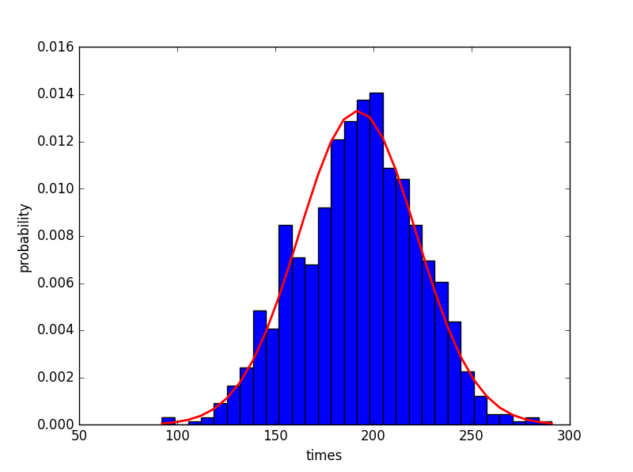
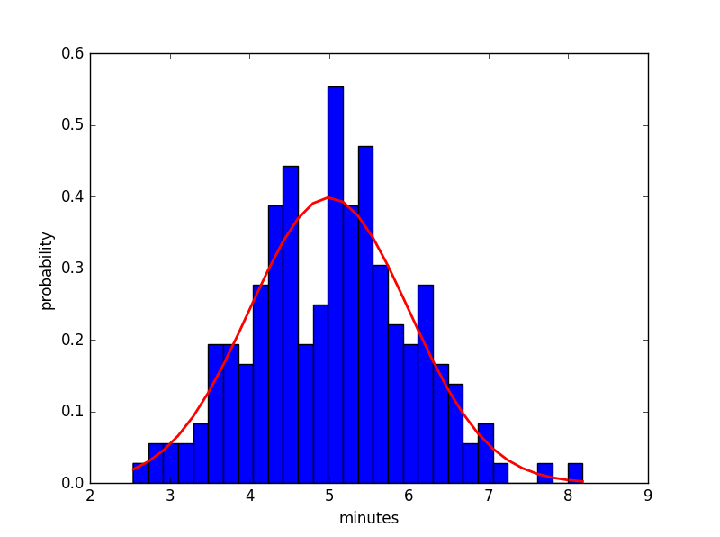

## 生成用户习惯时间表

> 总所周知，我们生活中大部分规律都符合正态分布。即大部分时间都处于正常的状态。为了应对Sina微博反垃圾用户（意指并非真正的用户），所以我们需要设定一个时刻表，与传统定时，定间隔运行程序相异。[详细内容移步简书](http://www.jianshu.com/p/cd795679f95d)

### normal.py使用了numpy包提供的[random.normal()](http://docs.scipy.org/doc/numpy/reference/generated/numpy.random.normal.html)方法

* normalDay()设定用户每天刷新微博的次数，这个每天的次数符合正态分布

* normalMinutes()设定用户每天刷新微博的时间间隔符合正态分布

### 1000天的时间表在schedule,程序将会在6:00am-22:00pm工作。